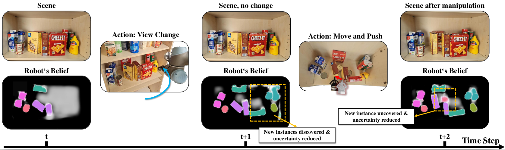
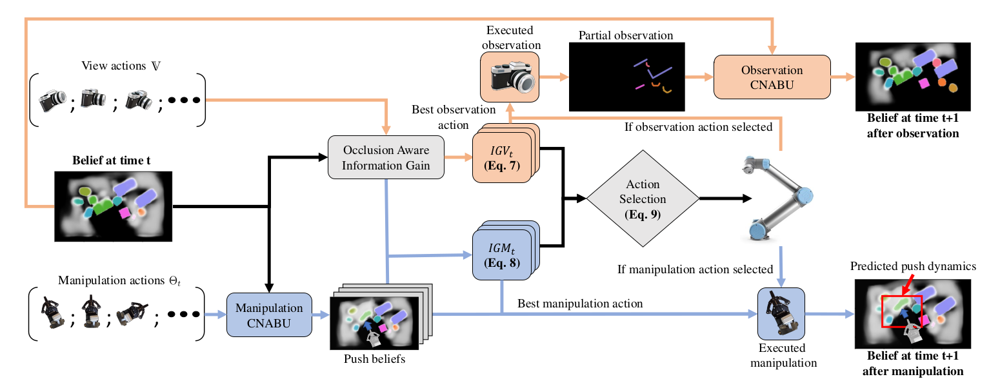

# Map Space Belief Prediction for  Manipulation-Enhanced Mapping

This repository will contain the code for reproducing the work of the RSS 2025 paper "Map Space Belief Prediction for Manipulation-Enhanced Mapping", as well as the code for training the Calibrated Neural-Accelerated
Belief Update (CNABU) networks introduced in this paper. **The formal code release is coming soon for RSS 2025.**

# Overview

From a prior map belief, our pipeline predicts a map belief resulting from a set of candidate pushes. It then weighs the information gain from taking two consecutive independent views given the current belief (orange arrows) or taking a single observation given any of the predicted beliefs after pushing (blue arrows), selecting the path of highest cumulative information gain and taking its respective first action -- either taking the next best view or executing the best push. $IGV_t$ represents the best information gain obtainable from taking two distinct observation actions, whereas $IGM_t$ is the best information gain obtainable through a manipulation action followed by an observation action. 
	} 

 # Installation
 **coming soon**
